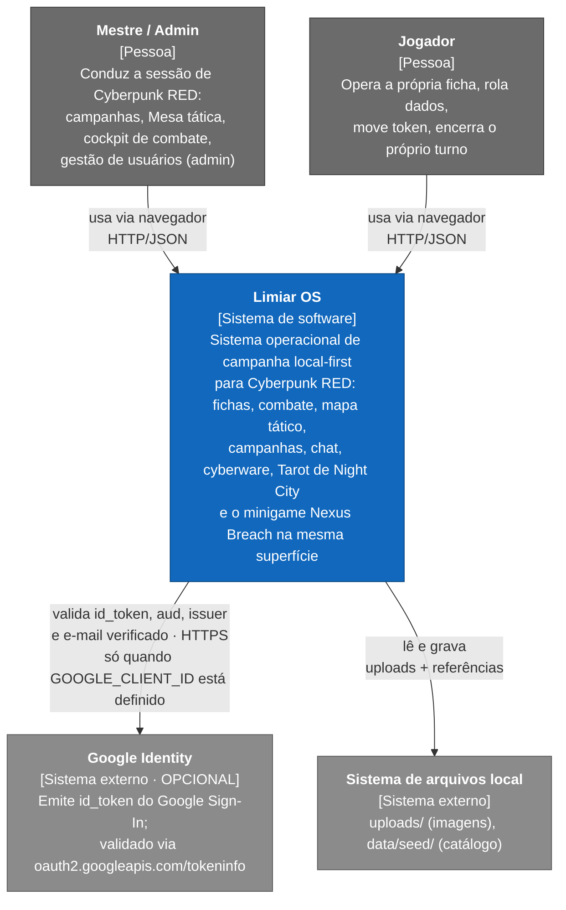
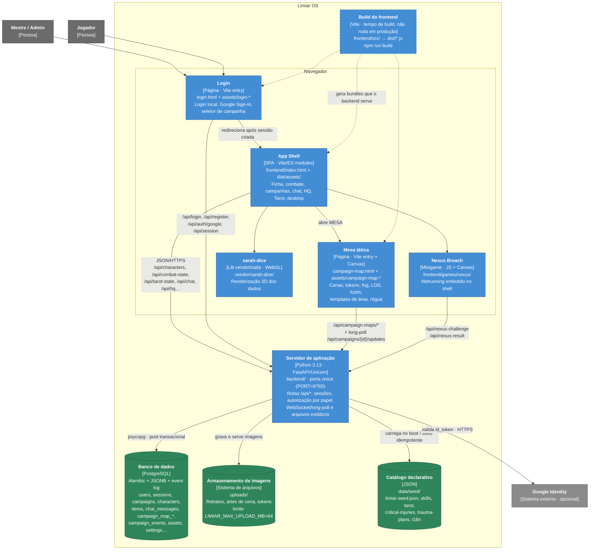
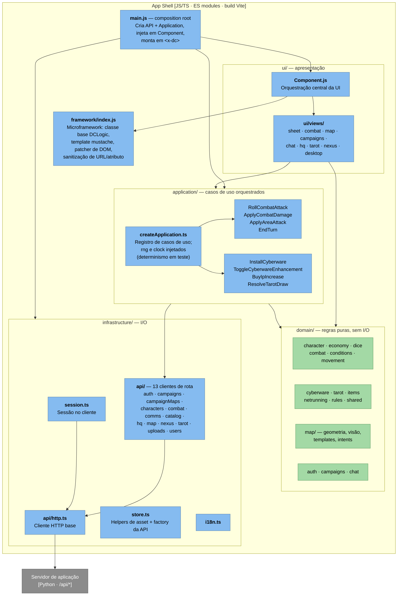
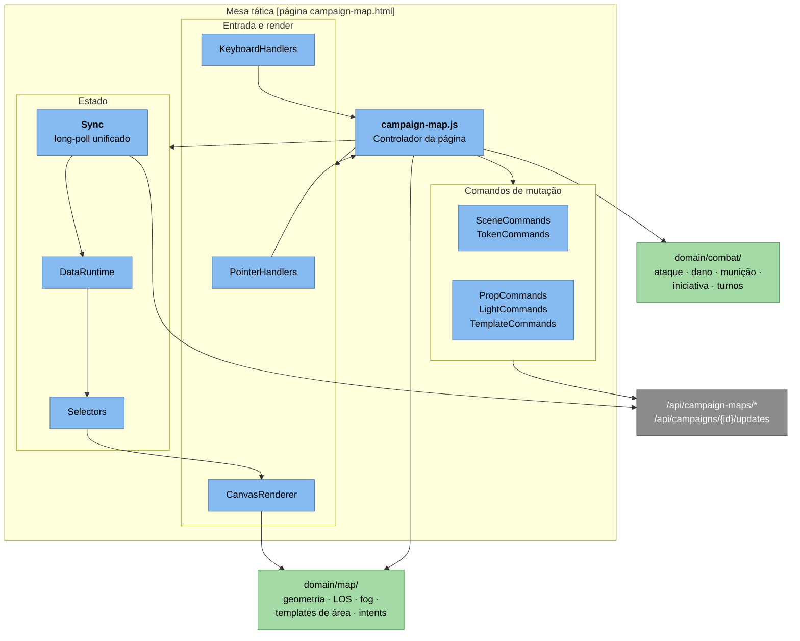
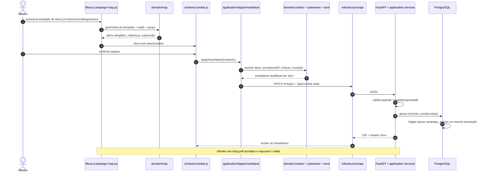
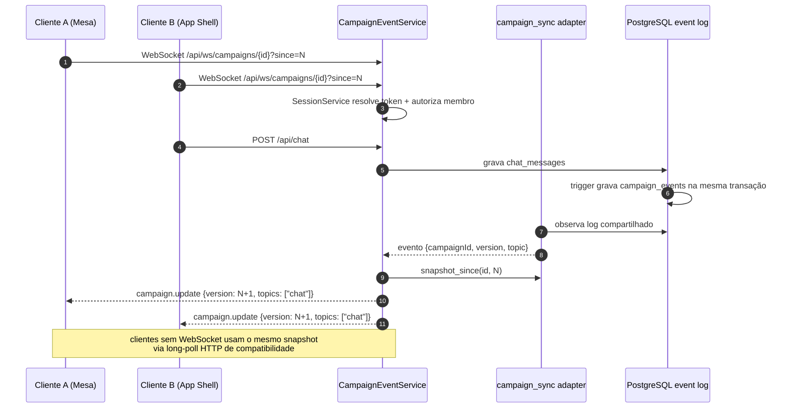

# Limiar OS — Diagrama C4

Modelo C4 do produto no estado atual do checkout (`main`). Quatro níveis:
Contexto (L1), Contêineres (L2), Componentes (L3, backend e frontend) e
diagramas dinâmicos (L4) para os dois fluxos que mais definem o sistema.

Convenção de cor nos diagramas:

| Cor | Significado |
| --- | --- |
| azul | escopo interno do Limiar OS |
| cinza | pessoa / sistema externo |
| verde | armazenamento |

---

## Nível 1 — Contexto do sistema

Quem usa o Limiar OS e com o que ele fala fora das próprias fronteiras.

**Ponto de arquitetura:** não há dependência externa obrigatória. Login
local com usuário/senha (PBKDF2-HMAC em `backend/security.py`) funciona sem
provedor nenhum; a ausência de `GOOGLE_CLIENT_ID` desabilita a integração
Google sem bloquear o acesso.

---

## Nível 2 — Contêineres

O que roda como unidade executável/deployável separada. Detalhe importante:
**tudo é servido por um único processo Python numa única porta** (8765 por
padrão) — o backend serve `/api/*` *e* os estáticos, incluindo os bundles de
`dist/`.

**Consequência operacional:** mudanças em `frontend/src/` só aparecem no
servidor real depois de `npm run build` — o backend serve `dist/`, não o
código-fonte. Um servidor estático mostra HTML/CSS mas não prova nada sobre
auth, persistência ou regras apoiadas em API.

---

## Nível 3a — Componentes do servidor de aplicação

`backend/` usa FastAPI nativo. Cada router traduz HTTP para um serviço de
aplicação; os serviços dependem de ports, e os adapters PostgreSQL/filesystem
ficam em `backend/repositories/`. Não existe dispatcher ou handler legado.

```mermaid
flowchart TB
    subgraph api["Servidor de aplicação [Python]"]
        direction TB

        subgraph routes["backend/routers/ — endpoints FastAPI nativos"]
            direction LR
            base["<b>common</b><br/>Dependências de sessão,<br/>limite de corpo e envelope de erro"]
            auth["<b>AuthRoutes</b><br/>auth.py<br/>/api/login, /api/logout, /api/register,<br/>/api/session, /api/auth/google,<br/>/api/users*, /api/password-reset-requests*"]
            camp["<b>CampaignRoutes</b><br/>campaigns.py<br/>/api/campaigns*, convites, membros,<br/>/api/notifications, canal de updates"]
            maps["<b>CampaignMapRoutes</b><br/>campaign_maps.py<br/>/api/campaign-maps/* — cenas, tokens,<br/>walls, luzes, fog, reveals, props,<br/>templates, drawings, pins, pings"]
            chars["<b>CharacterRoutes</b><br/>characters.py<br/>/api/characters*, /api/player-characters"]
            cat["<b>CatalogRoutes</b><br/>catalog.py<br/>/api/items*, /api/reference/*, /api/map"]
            state["<b>StateRoutes</b><br/>state.py<br/>/api/combat-state (+/end-turn),<br/>/api/tarot-state, /api/hq,<br/>/api/nexus-challenge, /api/nexus-result"]
            comms["<b>CommsRoutes</b><br/>comms.py<br/>/api/chat"]
            meta["<b>MetaRoutes</b><br/>meta.py<br/>/api/health, /api/meta/config,<br/>/api/meta/login-art, /api/i18n"]
            upl["<b>UploadRoutes</b><br/>uploads.py<br/>/api/uploads/images"]
        end

        subgraph repos["backend/repositories/ — persistência"]
            direction LR
            rrec["<b>records</b><br/>Documentos tipados genéricos<br/>(fichas, itens, estados)"]
            rcamp["<b>campaigns</b><br/>Campanhas, membros, convites"]
            rid["<b>identity</b><br/>Unit of work transacional<br/>users, sessions e password resets"]
            rmaps["<b>campaign_map_*</b><br/>Fachada + cenas, elementos,<br/>exploração, templates, tokens e projection"]
            rchat["<b>chat</b><br/>chat_messages"]
            rsync["<b>campaign_sync</b><br/>Event log PostgreSQL compartilhado,<br/>tópicos map/chat/combat/roster,<br/>stream entre múltiplos workers"]
        end

        dom["<b>domain/validation.py</b><br/>Validação de payload no servidor<br/>(a regra de CPR vive no frontend)"]
        sec["<b>security.py</b><br/>PBKDF2-HMAC + verificação de senha,<br/>rate limiting por IP"]
        appsvc["<b>application/</b><br/>Casos de uso, autorização e ports<br/>Identity, Session e CampaignEvent services<br/>sem dependência de FastAPI"]
        dbm["<b>db.py + migrations/</b><br/>Pool psycopg, Alembic,<br/>JSONB e seed idempotente"]
        cfg["<b>config.py</b><br/>PORT, HOST, DATABASE_URL, UPLOAD_DIR,<br/>LIMIAR_SESSION_TTL, LIMIAR_MAX_UPLOAD_MB,<br/>LIMIAR_GM_USER/PASSWORD"]
    end

    db[("PostgreSQL<br/>schema Alembic")]
    files[("uploads/ · data/seed/")]
    google["Google Identity<br/>[externo · opcional]"]

    auth --> sec
    auth --> google
    routes --> base
    auth --> appsvc
    chars --> appsvc
    cat --> appsvc
    state --> appsvc
    camp --> appsvc
    maps --> appsvc
    comms --> appsvc
    appsvc --> rid
    appsvc --> rrec
    appsvc --> rcamp
    appsvc --> rmaps
    appsvc --> rchat
    appsvc --> rsync
    routes --> dom
    upl --> files
    cat --> files
    repos --> dbm
    dbm --> db
    base --> cfg

    classDef comp fill:#85bbf0,stroke:#5d82a8,color:#000
    classDef store fill:#2f855a,stroke:#22543d,color:#fff
    classDef external fill:#8b8b8b,stroke:#5f5f5f,color:#fff
    class base,auth,camp,maps,chars,cat,state,comms,meta,upl,rid,rrec,rcamp,rmaps,rchat,rsync,dom,sec,appsvc,dbm,cfg comp
    class db,files store
    class google external
```

**Assimetria deliberada:** o backend é fino. Ele valida payload, aplica
papel/propriedade e persiste. As regras de Cyberpunk RED vivem no frontend,
em módulos puros — ver o nível 3b.

---

## Nível 3b — Componentes do App Shell (frontend)

Arquitetura em quatro camadas dentro de `frontend/src/`. A dependência aponta
sempre para dentro: `ui → application → domain`, com `infrastructure`
injetada por baixo a partir do composition root.

**Regra que sustenta o desenho:** o canvas da Mesa coleta geometria e
contexto, nunca decide resultado mecânico. Quem decide é `domain/`, puro e
testável; `application/` prepara a mutação; `infrastructure/api` persiste.

---

## Nível 3c — Componentes da Mesa tática

`frontend/src/pages/` — a Mesa é uma página própria, com seu próprio
controlador e ciclo de sincronização.

---

## Nível 4a — Dinâmico: ataque de área resolvido na Mesa

Mostra a assimetria frontend-regra / backend-persistência em um caso concreto.

---

## Nível 4b — Dinâmico: canal unificado de sincronização

`CampaignEventService` é a fronteira comum do WebSocket e do fallback HTTP.
O adapter `campaign_sync.py` mantém versões e tópicos no PostgreSQL, permitindo
que cada processo observe commits feitos por qualquer outra réplica.

---

## Fronteiras que o diagrama torna explícitas

1. **Um processo de aplicação, uma porta.** FastAPI/Uvicorn serve API,
   WebSocket e estáticos; PostgreSQL é o único tier persistente e permite
   múltiplos processos compartilharem sessões e eventos de campanha.
2. **Regra no cliente, autorização no servidor.** As regras de CPR são
   frontend puro; o backend impõe papel (`admin`/`gm`/`player`) e propriedade.
   Rotas estreitas como `/api/combat-state/end-turn` existem exatamente para
   dar ao jogador um poder específico sem abrir o estado de combate inteiro.
3. **Local-first de verdade.** Google Identity é o único sistema externo, e é
   opcional. Sem `GOOGLE_CLIENT_ID`, nada quebra.
4. **`dist/` é fronteira de contêiner.** O código-fonte em `frontend/src/` não
   é servido; é insumo de build. Verificar comportamento exige build + servidor
   real.
5. **Tabelas de mapa dominam o schema.** 11 das 25 tabelas são
   `campaign_map_*`. A Mesa é o subsistema mais pesado em estado persistido.
