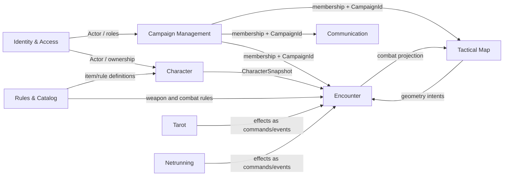
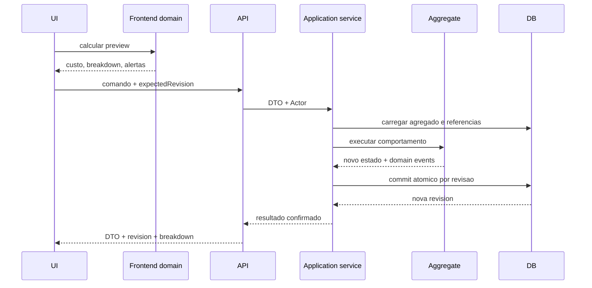

# Evolucao para DDD e dominio limpo no Limiar OS

> Diagnostico arquitetural, arquitetura-alvo e plano incremental.
>
> Snapshot analisado: 2026-08-07. Este documento e deliberadamente mais
> detalhado que o roadmap: ele explica as decisoes, os limites de dominio e os
> exemplos de implementacao. O `docs/ROADMAP.md` continua sendo a fonte da ordem
> operacional das entregas.

## 1. Resumo executivo

O Limiar OS ja possui uma boa separacao estrutural de Clean Architecture:

- os routers FastAPI traduzem HTTP;
- os servicos de aplicacao concentram autorizacao e orquestracao;
- ports isolam parte da persistencia;
- repositories implementam PostgreSQL e filesystem;
- o frontend separa `domain`, `application`, `infrastructure` e `ui`;
- o gate `scripts/check-architecture.py` impede varias dependencias apontando
  para fora.

Isso e uma base forte. A principal lacuna nao e a direcao das dependencias, mas
o lugar onde a verdade do negocio vive. Hoje, a maior parte das regras ricas de
Cyberpunk RED esta no frontend, enquanto o backend valida poucos campos e
persiste documentos flexiveis. Essa escolha e adequada para previews, calculos
instantaneos e uma interface responsiva, mas e insuficiente como fronteira de
consistencia de um sistema multiusuario.

Em termos diretos:

> O projeto esta proximo de Clean Architecture por camadas, mas o backend ainda
> possui um modelo de dominio anemico e orientado a documentos. A evolucao
> recomendada e transformar o backend em processador autoritativo de comandos,
> sem perder os motores puros e bem testados do frontend.

A mudanca nao deve ser uma reescrita. O caminho mais seguro e um **monolito
modular**, migrado por fatias verticais. Cada fatia deve introduzir uma
linguagem explicita, um agregado, comandos pequenos, concorrencia otimista,
transacao e testes de invariantes.

As prioridades sao:

1. isolar todo estado compartilhado por campanha;
2. proteger fichas e encontros contra escrita concorrente;
3. impedir que comandos mecanicos sejam gravados como substituicao arbitraria
   de documentos;
4. criar ports e DTOs especificos para cada contexto;
5. mover gradualmente para o servidor as invariantes das operacoes que alteram
   estado;
6. publicar eventos semanticos depois do commit;
7. decompor a UI usando os mesmos limites do dominio.

## 2. O que ja esta correto e deve ser preservado

### 2.1 Dependencias apontando para dentro

O verificador `scripts/check-architecture.py` ja formaliza regras importantes:

- dominio backend nao depende de FastAPI, repositories ou routers;
- aplicacao backend nao depende de adapters;
- repositories nao dependem do transporte;
- dominio frontend nao depende de UI ou infraestrutura;
- aplicacao frontend nao depende diretamente dos adapters concretos;
- routers nao executam SQL.

Essas regras devem permanecer. A evolucao proposta adiciona novas fitness
functions; ela nao substitui as existentes.

### 2.2 Motores puros no frontend

Os modulos em `frontend/src/domain/` sao um ativo real. Combate, condicoes,
itens, cyberware, personagem, dados, mapa e tarot possuem muitas funcoes puras,
tipos e testes deterministas. Isso permite:

- testar regras sem DOM nem rede;
- injetar relogio e RNG;
- produzir breakdowns explicaveis para o jogador;
- validar regras CPR contra fixtures e casos RAW;
- manter a UI responsiva.

Esses motores nao devem ser descartados. A distincao necessaria e:

- **frontend:** preview, explicacao, simulacao, apresentacao e otimismo de UI;
- **backend:** autorizacao, invariantes de gravacao, versao esperada, transacao
  e resultado persistido.

### 2.3 A Mesa como referencia de concorrencia

A Mesa ja apresenta um padrao que pode ser generalizado:

- `campaign_id` em suas entidades;
- `scene.revision`;
- `expectedRevision` nos comandos;
- resposta 409 para revisao divergente;
- mutacoes transacionais;
- projecao diferente conforme audiencia;
- eventos de sincronizacao por campanha.

Isso torna o contexto da Mesa o melhor exemplo interno para `Character` e
`Encounter`. Nao e preciso inventar um segundo protocolo de concorrencia.

### 2.4 Composition roots explicitos

`backend/dependencies.py` e `frontend/src/main.js` ja funcionam como pontos de
composicao. A arquitetura-alvo deve continuar montando implementacoes concretas
somente nesses pontos, mantendo dominio e casos de uso independentes.

## 3. Diagnostico do estado atual

### 3.1 Documentos flexiveis atravessam todas as camadas

O alias backend `Record = dict[str, object]` e o schema HTTP `Document` com
`extra="allow"` tornam a transicao de um modelo legado mais facil, mas tambem
apagam a linguagem do dominio.

Por exemplo, estas operacoes possuem essencialmente o mesmo formato tecnico:

- salvar uma ficha;
- salvar um item;
- salvar estado de combate;
- salvar tarot;
- atualizar HQ.

Entretanto, elas possuem invariantes, autorizacoes e ciclos de vida muito
diferentes. Um `RecordRepository.upsert(kind, payload)` nao informa:

- quais campos podem mudar;
- quem pode muda-los;
- qual e a revisao esperada;
- quais invariantes precisam ser verificadas;
- quais eventos resultam da operacao;
- qual e o limite transacional.

O problema nao e usar JSONB. O problema e deixar um documento arbitrario ser o
contrato de comando e o modelo de dominio ao mesmo tempo.

### 3.2 Backend valida formato, mas poucas invariantes mecanicas

`backend/domain/validation.py` valida e sanitiza strings, login, nomes e alguns
campos simples. Isso e util, mas e majoritariamente validacao de entrada e
seguranca de payload, nao comportamento do dominio CPR.

O backend ainda nao possui objetos que expressem operacoes como:

- `Character.purchase_skill(...)`;
- `Character.install_cyberware(...)`;
- `Character.receive_damage(...)`;
- `Encounter.end_turn(...)`;
- `Campaign.invite(...)`;
- `TarotSession.draw(...)`.

Consequentemente, o servidor pode aceitar um estado final sem conseguir provar
como aquele estado foi obtido.

### 3.3 A ficha do jogador e uma superficie de escrita ampla

O endpoint `/api/player-characters` recebe um documento quase inteiro. O
servico verifica propriedade, inclui `ownerUsername` e salva o resultado, mas
nao diferencia campos narrativos de recursos mecanicos.

Um cliente modificado pode tentar enviar diretamente:

- mais IP;
- mais creditos;
- HP restaurado;
- cyberware incompativel;
- skill acima do limite;
- log de progressao reescrito;
- inventario que nunca foi comprado.

Mesmo em um produto local-first e GM-friendly, a API deve representar a regra
de negocio. Quando o GM quiser quebrar uma regra, isso deve ser uma acao
explicita e auditavel, como `GmOverride`, nao uma consequencia acidental de um
documento aberto.

### 3.4 Estado compartilhado ainda e global

`combat-state`, `tarot-state`, `hqIp`, `nexusChallenge` e `nexusResult` usam
chaves globais em `settings`. `chat_messages` tambem nao possui `campaign_id`.

Isso conflita com o modelo mental do produto: o usuario entra em uma campanha,
mas parte do estado pertence ao servidor inteiro. O efeito pratico e vazamento
de estado entre duas mesas.

DDD ajuda a tornar o problema obvio: `Encounter`, `TarotSession`, `HqLedger`,
`NetrunningChallenge` e `ChatChannel` pertencem a uma campanha. A identidade
da campanha faz parte da identidade dessas entidades.

### 3.5 Escrita concorrente sem revisao

Ficha e combate usam read-modify-write. Dois clientes podem ler a mesma versao,
calcular resultados diferentes e o ultimo `upsert` vence silenciosamente.

Exemplo:

1. GM e jogador leem a ficha na revisao 10;
2. GM aplica 8 de dano e calcula HP 22;
3. jogador compra uma skill e mantem o HP 30 recebido na leitura anterior;
4. GM salva HP 22;
5. jogador salva o documento inteiro com HP 30;
6. o dano desaparece.

Essa falha nao e resolvida por mais validacao de campos. Ela exige versao
esperada e update atomico.

### 3.6 Persistencias frontend sem confirmacao uniforme

Alguns casos de uso chamam `characters.upsert()` ou `chat.post()` sem aguardar
a Promise. A funcao retorna um resultado local antes de saber se o backend
aceitou a operacao.

Isso cria tres verdades concorrentes:

- o calculo retornado pelo dominio;
- o estado otimista mostrado pela UI;
- o estado realmente persistido.

Todo caso de uso que grava precisa ser `async` e retornar um resultado que
diferencie, pelo menos:

- confirmado;
- conflito de revisao;
- proibido;
- rejeitado por invariante;
- indisponibilidade de infraestrutura.

### 3.7 Ports amplos e adapters dinamicos

`CampaignMapService` usa `Any` e `__getattr__` para expor operacoes do
repository. `CampaignService` tambem recebe colaboradores como `Any`.

Isso preserva separacao fisica, mas enfraquece a separacao semantica:

- o caso de uso nao declara o menor conjunto de capacidades necessarias;
- erros de nome aparecem em runtime;
- testes nao provam o contrato completo;
- qualquer nova funcao do modulo repository fica implicitamente exposta.

### 3.8 Erros da aplicacao conhecem HTTP

`ApplicationError` recebe um status HTTP e usa `HTTPStatus` para construir o
codigo padrao. A camada de aplicacao, portanto, conhece a forma de entrega.

O comportamento desejado e o inverso:

- dominio/aplicacao levantam erros semanticos;
- o adapter HTTP mapeia esses erros para status e envelope;
- WebSocket, CLI ou testes podem mapear o mesmo erro de outra forma.

### 3.9 Pastas tecnicas nao expressam completamente os subdominios

A estrutura por camada e valida, mas obriga uma mudanca de contexto a tocar
varias arvores distantes:

```text
backend/domain/
backend/application/
backend/repositories/
backend/routers/
```

Quando os modulos crescerem, fica mais facil enxergar `application` como um
grupo de arquivos do que enxergar `Character` como uma unidade de negocio. A
estrutura-alvo proposta aproxima dominio, use cases, ports e adapters de cada
bounded context.

## 4. Principios para a evolucao

### 4.1 Regra antes da pasta

Nao mover arquivos apenas para produzir uma arvore com aparencia de DDD. Cada
migracao deve introduzir um ganho observavel, como:

- uma invariante que agora e protegida;
- uma escrita que agora e atomica;
- um comando que substitui um documento arbitrario;
- um port que fica explicito;
- um evento que passa a ter significado de negocio;
- um teste concorrente que passa a impedir perda silenciosa.

### 4.2 Campanha como particao, nao como mega-agregado

Quase todo estado de mesa possui `CampaignId`, mas isso nao significa que tudo
deva ser carregado ou salvo por um objeto `Campaign` gigante.

`CampaignId` deve:

- limitar consultas;
- compor identidades;
- orientar autorizacao;
- particionar eventos e sincronizacao;
- aparecer nos logs;
- impedir vazamento entre mesas.

Cada contexto mantem seu proprio agregado e sua propria transacao.

### 4.3 Comandos estreitos, queries convenientes

Queries podem continuar retornando projecoes grandes e convenientes para a UI.
Comandos devem ser pequenos e explicitos.

Exemplo:

- query: `GET /characters/{id}` retorna a ficha completa;
- comando: `POST /characters/{id}/progression/purchase` recebe somente a compra;
- comando: `POST /characters/{id}/notes` recebe somente notas;
- comando: `POST /characters/{id}/damage` recebe somente a intencao de dano.

Essa e uma aplicacao leve de CQRS. Nao exige bancos separados nem event
sourcing.

### 4.4 Invariantes no agregado, I/O na aplicacao

O agregado nao deve chamar banco, HTTP, relogio global ou RNG global.

O caso de uso deve:

1. autenticar e autorizar o ator;
2. carregar agregados e referencias;
3. fornecer RNG/relogio quando necessario;
4. invocar comportamento do dominio;
5. persistir com revisao esperada;
6. publicar eventos depois do commit;
7. retornar um DTO.

### 4.5 Override do GM e um comportamento do dominio

O produto declara que o GM tem a palavra final. Isso nao precisa enfraquecer o
modelo. Um override pode ser explicito:

```json
{
  "expectedRevision": 14,
  "itemCode": "experimental-cyberarm",
  "override": {
    "enabled": true,
    "reason": "Recompensa unica da campanha"
  }
}
```

Regras do override:

- apenas GM/admin autorizado da campanha;
- motivo obrigatorio;
- evento `RuleOverridden` auditavel;
- breakdown informa qual regra foi ignorada;
- nenhuma alteracao silenciosa de dados.

## 5. Context map proposto



### 5.1 Identity & Access

Responsabilidades:

- usuarios;
- credenciais e identidade Google;
- sessoes;
- `Actor` autenticado;
- papeis globais administrativos.

Nao deve decidir se alguem e dono de uma campanha ou de uma ficha. Deve
fornecer a identidade; os outros contextos aplicam suas politicas.

### 5.2 Campaign Management

Responsabilidades:

- criar, pausar e arquivar campanha;
- visibilidade publica/privada;
- convidar, aceitar e remover membros;
- associar uma ficha a um jogador;
- identificar o GM proprietario.

Linguagem sugerida:

- `Campaign`, `CampaignId`;
- `CampaignMember`;
- `CampaignInvite`;
- `CampaignOwner`;
- `CampaignStatus`;
- `CampaignVisibility`.

### 5.3 Character

Responsabilidades:

- atributos base;
- skills;
- HP, Humanity e recursos pessoais;
- IP e progressao;
- equipamento possuido;
- cyberware instalado;
- ferimentos e condicoes persistentes;
- notas narrativas e identidade do personagem.

Esse contexto nao controla ordem de turno. Ele pode aplicar os efeitos
persistentes resultantes de um encontro.

### 5.4 Encounter

Responsabilidades:

- inicio e fim de combate;
- participantes;
- iniciativa e ordem;
- round e turno atual;
- economia de turno;
- ataque, dano, ablation, criticos e condicoes do encontro;
- log mecanico do encontro.

Um encounter pertence a uma campanha. A principio pode existir um encounter
ativo por campanha; o modelo nao precisa assumir isso para sempre.

### 5.5 Tactical Map

Responsabilidades:

- cenas;
- geometria;
- tokens e ownership de movimento;
- walls, doors, fog, lights e terrain;
- props e templates;
- visibilidade e projecao por audiencia.

O mapa coleta contexto fisico. Ele nao decide sozinho o dano CPR. O
`systemAdapter` e uma anti-corruption layer adequada entre geometria e regras.

### 5.6 Rules & Catalog

Responsabilidades:

- catalogo canonico;
- definicoes de armas, armaduras, cyberware e skills;
- regras versionadas;
- leitura e auditoria das fontes canonicas.

O catalogo e predominantemente read-only durante uma sessao. Um `ItemDefinition`
nao e o mesmo objeto que um `OwnedItem` ou `InstalledCyberware` de um
personagem.

### 5.7 Communication

Responsabilidades:

- canal de chat por campanha;
- mensagens de texto;
- registros de rolagem;
- pedidos mecanicos quando forem apenas comunicacao.

Mensagens sao append-only. Limpar um canal deve ser uma operacao administrativa
explicita e auditavel.

### 5.8 Tarot e Netrunning

Podem permanecer contextos separados ou modulos dentro de `Session
Extensions`. A separacao e util porque possuem regras, ciclos e linguagem
proprios. Seus efeitos no mundo fisico devem entrar no Encounter/Character por
comandos ou eventos, nao por mutacao direta de documentos alheios.

## 6. Agregados e invariantes

### 6.1 Character como aggregate root

Identidade:

```text
CharacterId
OwnerUsername
Revision
```

Entidades e value objects internos possiveis:

- `Stats`;
- `SkillSet` e `SkillProgress`;
- `HitPoints`;
- `ArmorState`;
- `Humanity`;
- `ImprovementPoints`;
- `Credits`;
- `Inventory`;
- `InstalledCyberware`;
- `CriticalInjury`;
- `Condition`;
- `CharacterNotes`.

Invariantes exemplificativas:

- HP nunca fica abaixo de zero nem acima do maximo sem uma regra explicita;
- IP nunca fica negativo;
- skill nao ultrapassa o limite CPR;
- custo de skill dificil e calculado no dominio;
- Role Ability respeita custo e limite;
- cyberware so instala quando requisitos e slots permitem;
- creditos nao ficam negativos;
- Humanity considera o custo dos implantes instalados;
- uma mesma instancia de item nao pode ser instalada duas vezes;
- mudancas mecanicas incrementam a revisao;
- mudancas rejeitadas nao produzem evento nem gravacao parcial.

API de dominio ilustrativa:

```python
class Character:
    def purchase_skill(
        self,
        skill_id: SkillId,
        policy: ProgressionPolicy,
        occurred_at: datetime,
    ) -> SkillPurchased:
        next_level = self.skills.next_level(skill_id)
        cost = policy.skill_cost(skill_id, next_level)
        self.ip.spend(cost)
        self.skills.increase(skill_id)
        event = SkillPurchased(self.id, skill_id, next_level, cost, occurred_at)
        self._events.append(event)
        return event
```

### 6.2 Encounter como aggregate root

Identidade:

```text
EncounterId
CampaignId
Revision
```

Estado interno:

- ativo/inativo;
- round;
- ordem;
- turno atual;
- combatentes e flags efemeras;
- log de resolucoes;
- referencias a personagens, nao copias editaveis de fichas inteiras.

Invariantes:

- somente um combatente ativo por vez;
- combatente derrotado nao recebe turno;
- player so encerra o proprio turno;
- dois `end-turn` com a mesma revisao nao avancam duas vezes;
- inicio de novo round reseta flags apropriadas uma unica vez;
- resolucao de ataque registra o breakdown usado;
- um comando idempotente nao aplica dano novamente.

Um ataque pode tocar `Encounter` e `Character`. O application service coordena
os dois dentro de uma Unit of Work, sem fundi-los em um mega-agregado.

### 6.3 Scene como aggregate root

O modelo atual ja se aproxima desta forma:

- a cena possui revisao;
- elementos pertencem a cena/campanha;
- comandos exigem revisao esperada;
- a projecao filtra segredos.

Melhorias restantes:

- ports separados para cenas, tokens, exploracao, elementos e templates;
- remocao de `Any`/`__getattr__`;
- tipos de comando em vez de payloads livres;
- eventos com nomes de negocio, por exemplo `DoorToggled`, `TokenMoved` e
  `TemplateResolved`.

### 6.4 Campaign como aggregate root

Invariantes:

- sistema e imutavel depois da criacao;
- apenas owner/admin gerencia a campanha;
- convite aceito nao permanece pendente;
- um usuario possui no maximo uma ficha vinculada por campanha;
- uma ficha nao fica vinculada a dois membros da mesma campanha;
- campanha arquivada nao aceita novas operacoes de sessao, salvo politicas
  administrativas explicitas.

### 6.5 Objetos que nao precisam ser agregados ricos

- `ChatMessage`: registro append-only;
- `CatalogItemDefinition`: definicao read-only;
- `CampaignEventCursor`: mecanismo tecnico de sincronizacao;
- DTOs de query: projecoes sem comportamento.

DDD nao exige transformar toda tabela em entidade rica.

## 7. Modelo de autoridade entre frontend e backend

### 7.1 Estado desejado



### 7.2 Evitando duas implementacoes divergentes

Durante a migracao, algumas regras existirao em TypeScript e Python. Para
reduzir drift:

1. manter definicoes canonicas em JSON declarativo quando apropriado;
2. criar vetores de conformidade compartilhados;
3. executar os mesmos vetores nas suites frontend e backend;
4. comparar breakdowns, nao apenas o valor final;
5. portar primeiro somente regras de operacoes que alteram estado;
6. manter funcoes frontend como preview e explicacao;
7. quando uma regra for complexa demais para duplicar, oferecer endpoint de
   `preview` usando o mesmo dominio backend do comando.

Exemplo de fixture compartilhada:

```json
{
  "case": "skill-dificil-nivel-5",
  "input": {
    "currentLevel": 4,
    "difficult": true
  },
  "expected": {
    "nextLevel": 5,
    "cost": 100
  }
}
```

## 8. Contratos HTTP e comandos

Os exemplos abaixo sao arquitetura-alvo, nao contratos ja implementados.

### 8.1 Compra de skill

```http
POST /api/campaigns/{campaignId}/characters/{characterId}/progression/purchase
Content-Type: application/json
```

```json
{
  "kind": "skill",
  "skillId": "handgun",
  "expectedRevision": 12,
  "idempotencyKey": "01J..."
}
```

Resposta:

```json
{
  "characterId": "v",
  "revision": 13,
  "purchase": {
    "skillId": "handgun",
    "previousLevel": 4,
    "newLevel": 5,
    "cost": 50,
    "remainingIp": 20
  }
}
```

Falha de dominio:

```json
{
  "error": {
    "code": "INSUFFICIENT_IMPROVEMENT_POINTS",
    "message": "A compra custa 50 IP; o personagem possui 30 IP.",
    "details": {
      "required": 50,
      "available": 30
    }
  }
}
```

### 8.2 Instalacao de cyberware

```json
{
  "itemCode": "neural-link",
  "source": "inventory",
  "expectedRevision": 13,
  "idempotencyKey": "01J..."
}
```

O backend carrega a definicao pelo `itemCode`; o cliente nao envia a definicao
completa do item. Assim, nao pode alterar preco, Humanity Loss ou requisitos no
payload.

Resposta:

```json
{
  "characterId": "v",
  "revision": 14,
  "installed": {
    "instanceId": "cyb-01J...",
    "itemCode": "neural-link"
  },
  "humanity": {
    "before": 52,
    "loss": 7,
    "after": 45
  },
  "warnings": []
}
```

### 8.3 Aplicacao de dano

O servidor deve receber a intencao e dados auditaveis, nao simplesmente uma
ficha final.

```json
{
  "targetId": "v",
  "source": {
    "kind": "weapon",
    "actorId": "solo-1",
    "weaponInstanceId": "weapon-3"
  },
  "damageRoll": {
    "faces": [6, 5, 4, 3],
    "total": 18
  },
  "location": "body",
  "expectedCharacterRevision": 14,
  "expectedEncounterRevision": 7,
  "idempotencyKey": "01J..."
}
```

Resposta:

```json
{
  "characterRevision": 15,
  "encounterRevision": 8,
  "result": {
    "rolledDamage": 18,
    "armorBefore": 11,
    "armorAfter": 10,
    "hpBefore": 30,
    "hpAfter": 23,
    "criticalTriggered": false
  },
  "events": ["CharacterDamaged", "ArmorAblated"]
}
```

Para maior autoridade, uma etapa futura pode fazer o servidor tambem gerar a
rolagem ou verificar uma rolagem assinada pela sessao. Isso nao e necessario
para obter imediatamente os beneficios de agregados e concorrencia.

### 8.4 Edicao narrativa

Campos narrativos podem continuar com um patch estreito:

```json
{
  "expectedRevision": 15,
  "notes": "Encontrar Alt Cunningham",
  "alliances": "Aldecaldos"
}
```

O DTO deve rejeitar campos adicionais. Um cliente que tentar incluir `ip` ou
`health` recebe 422.

### 8.5 Importacao administrativa

Ainda pode existir uma operacao de documento completo para migracao ou
recuperacao:

```http
POST /api/admin/characters/import
```

Ela deve:

- exigir admin/GM autorizado;
- validar schema versionado;
- registrar `CharacterImported`;
- nunca ser usada pelo fluxo normal da UI;
- oferecer dry-run com lista de problemas.

## 9. DTOs, value objects e tipos

### 9.1 DTO nao e entidade

Um Pydantic model de request descreve o contrato HTTP. Ele nao deve receber
metodos de negocio nem ser passado ate o repository como se fosse agregado.

```python
class PurchaseProgressionRequest(BaseModel):
    model_config = ConfigDict(extra="forbid")

    kind: Literal["skill", "role"]
    skill_id: str | None = Field(alias="skillId", default=None)
    expected_revision: int = Field(alias="expectedRevision", ge=0)
    idempotency_key: str = Field(alias="idempotencyKey", min_length=8)
```

O router converte para um comando:

```python
command = PurchaseProgression(
    campaign_id=CampaignId(campaign_id),
    character_id=CharacterId(character_id),
    kind=ProgressionKind(payload.kind),
    skill_id=SkillId(payload.skill_id) if payload.skill_id else None,
    expected_revision=Revision(payload.expected_revision),
    idempotency_key=IdempotencyKey(payload.idempotency_key),
    actor=actor,
)
```

### 9.2 Value objects sugeridos

- `CampaignId`, `CharacterId`, `EncounterId`, `SceneId`;
- `Revision`;
- `Username`;
- `HitPoints`;
- `ImprovementPoints`;
- `Credits`;
- `Humanity`;
- `SkillLevel`;
- `ArmorStoppingPower`;
- `DiceRoll`;
- `IdempotencyKey`;
- `OccurredAt`.

Nao e necessario encapsular todo inteiro imediatamente. Priorizar value objects
que eliminem estados invalidos ou erros de unidade.

## 10. Ports especificos

### 10.1 Character

```python
class CharacterRepository(Protocol):
    def get(self, character_id: CharacterId) -> Character | None: ...

    def save(
        self,
        character: Character,
        *,
        expected_revision: Revision,
        transaction: Transaction,
    ) -> CharacterSnapshot: ...
```

### 10.2 Campaign access

```python
class CampaignAccessPolicy(Protocol):
    def require_member(self, campaign_id: CampaignId, actor: Actor) -> None: ...
    def require_owner(self, campaign_id: CampaignId, actor: Actor) -> None: ...
```

### 10.3 Rules catalog

```python
class RulesCatalog(Protocol):
    def skill(self, skill_id: SkillId) -> SkillDefinition: ...
    def item(self, item_code: ItemCode) -> ItemDefinition: ...
```

### 10.4 Unit of Work

```python
class UnitOfWork(Protocol):
    characters: CharacterRepository
    encounters: EncounterRepository
    outbox: DomainEventOutbox

    def __enter__(self) -> "UnitOfWork": ...
    def commit(self) -> None: ...
    def rollback(self) -> None: ...
```

### 10.5 Mesa

Em vez de uma fachada dinamica unica:

- `SceneRepository`;
- `TokenRepository`;
- `ExplorationRepository`;
- `MapElementRepository`;
- `TemplateRepository`;
- `MapProjectionReader`.

Cada caso de uso recebe apenas os ports utilizados. A projecao de leitura pode
ser ampla; os ports de comando devem ser pequenos.

## 11. Concorrencia otimista

### 11.1 Schema

```sql
ALTER TABLE characters
ADD COLUMN revision INTEGER NOT NULL DEFAULT 0;

CREATE TABLE encounters (
  id TEXT PRIMARY KEY,
  campaign_id TEXT NOT NULL REFERENCES campaigns(id) ON DELETE CASCADE,
  state JSONB NOT NULL,
  revision INTEGER NOT NULL DEFAULT 0,
  created_at TIMESTAMPTZ NOT NULL DEFAULT CURRENT_TIMESTAMP,
  updated_at TIMESTAMPTZ NOT NULL DEFAULT CURRENT_TIMESTAMP
);
```

### 11.2 Update atomico

```sql
UPDATE characters
SET extra = %(extra)s,
    revision = revision + 1,
    updated_at = CURRENT_TIMESTAMP
WHERE id = %(id)s
  AND revision = %(expected_revision)s
RETURNING revision;
```

Se nenhuma linha voltar:

```python
raise RevisionConflict(
    aggregate="Character",
    aggregate_id=str(character.id),
    expected=expected_revision,
)
```

### 11.3 Resposta de conflito

```json
{
  "error": {
    "code": "REVISION_CONFLICT",
    "message": "A ficha mudou em outro cliente.",
    "details": {
      "aggregate": "Character",
      "expectedRevision": 12,
      "currentRevision": 13
    }
  }
}
```

### 11.4 Comportamento do cliente

O cliente nao deve reenviar automaticamente um documento inteiro. Ele deve:

1. buscar a revisao atual;
2. verificar se o comando ainda e aplicavel;
3. reapresentar o preview quando o custo/resultado mudou;
4. repetir o mesmo comando com nova confirmacao quando seguro;
5. preservar o `idempotencyKey` somente se estiver confirmando a mesma acao;
6. mostrar conflito manual quando houver ambiguidade.

## 12. Transacoes e idempotencia

### 12.1 Uma acao do usuario, uma transacao

`ApplyDamage` pode alterar:

- HP do personagem;
- SP da armadura;
- ferimento critico;
- estado do encounter;
- log mecanico;
- outbox de eventos.

Essas gravacoes pertencem a uma unica acao e devem confirmar ou reverter
juntas.

### 12.2 AoE

O fluxo atual trata falhas parciais no cliente. Como etapa intermediaria isso e
melhor que ignorar Promises, mas o destino ideal e um comando atomico do
backend:

```text
ResolveAreaAttack
  - valida template e revision
  - calcula/valida alvos
  - aplica todos os Character patches
  - marca template como resolvido
  - grava eventos
  - commit
```

Se a decisao de produto permitir sucesso parcial, essa parcialidade deve ser
uma regra explicita do comando e persistida como tal, nao resultado acidental
de `Promise.allSettled`.

### 12.3 Idempotency key

Operacoes que causam dano, gasto ou avancam turno devem aceitar uma chave de
idempotencia. Se uma resposta se perder e o cliente repetir a requisicao, o
servidor retorna o resultado original sem aplicar novamente.

Tabela ilustrativa:

```sql
CREATE TABLE processed_commands (
  campaign_id TEXT NOT NULL,
  actor_username TEXT NOT NULL,
  idempotency_key TEXT NOT NULL,
  command_name TEXT NOT NULL,
  response JSONB NOT NULL,
  created_at TIMESTAMPTZ NOT NULL DEFAULT CURRENT_TIMESTAMP,
  PRIMARY KEY (campaign_id, actor_username, idempotency_key)
);
```

## 13. Erros de dominio e mapeamento

Erros semanticos:

```python
class DomainError(Exception):
    code: str

class InsufficientImprovementPoints(DomainError): ...
class SkillAtMaximumLevel(DomainError): ...
class CyberwareRequirementNotMet(DomainError): ...
class NotActiveCombatant(DomainError): ...
class RevisionConflict(DomainError): ...
class CampaignAccessDenied(DomainError): ...
```

O adapter HTTP possui o mapa:

```python
ERROR_STATUS = {
    InsufficientImprovementPoints: 422,
    SkillAtMaximumLevel: 409,
    RevisionConflict: 409,
    CampaignAccessDenied: 403,
}
```

O cliente HTTP precisa preservar `code`, `message` e `details`:

```ts
export class ApiError extends Error {
  constructor(
    readonly status: number,
    readonly code: string,
    message: string,
    readonly details?: unknown,
  ) {
    super(message);
  }
}
```

Assim, a UI trata `REVISION_CONFLICT` sem analisar strings.

## 14. Eventos de dominio e sincronizacao

### 14.1 Evento de dominio nao e apenas topico de invalidacao

O event log atual usa topicos como `map`, `chat`, `combat` e `roster`. Eles sao
uteis para dizer ao cliente o que recarregar, mas nao descrevem o que aconteceu.

Eventos semanticos sugeridos:

- `CampaignMemberJoined`;
- `CharacterCreated`;
- `SkillPurchased`;
- `CyberwareInstalled`;
- `CharacterDamaged`;
- `ArmorAblated`;
- `CriticalInjurySuffered`;
- `EncounterStarted`;
- `TurnEnded`;
- `RoundStarted`;
- `TokenMoved`;
- `TemplateResolved`;
- `TarotCardDrawn`;
- `RuleOverridden`.

### 14.2 Domain event, integration event e UI topic

Podem coexistir:

- domain event: produzido pelo agregado;
- integration event: persistido para outros contextos;
- UI topic: projecao simples que faz clientes recarregarem `combat` ou
  `roster`.

Exemplo:

```text
CharacterDamaged
  -> atualiza projecao do roster
  -> emite topic "roster"
  -> emite topic "combat"
  -> adiciona mensagem mecanica no log, se a politica da campanha pedir
```

### 14.3 Outbox transacional

Eventos devem ser gravados na mesma transacao do agregado. Um worker ou o
proprio processo publica depois. Isso evita:

- estado salvo sem notificacao;
- notificacao enviada para estado que sofreu rollback;
- sockets atualizados antes do commit.

Nao e necessario adotar event sourcing. O banco continua guardando estado
atual; os eventos registram fatos relevantes e alimentam integracoes.

## 15. Persistencia e JSONB

DDD nao exige uma tabela para cada value object. JSONB pode continuar adequado
para partes flexiveis da ficha. A separacao recomendada e:

### Colunas estruturais

- `id`;
- `owner_username`;
- `campaign_id` quando aplicavel;
- `revision`;
- `schema_version`;
- campos usados em constraints e consultas;
- timestamps.

### JSONB interno

- detalhes da ficha;
- inventario;
- historico de progressao;
- condicoes extensveis;
- dados narrativos.

O repository traduz JSONB para o agregado e vice-versa. Camadas superiores nao
devem conhecer `_DOMAIN`, colunas `extra` ou detalhes de serializacao.

Constraints importantes continuam no banco:

- foreign keys;
- unicidade de vinculo por campanha;
- revisao nao negativa;
- enums/checks simples;
- ownership e identidade referencial quando possivel.

## 16. Estrutura de codigo alvo

Uma estrutura vertical possivel:

```text
backend/
  modules/
    identity/
      domain/
      application/
      infrastructure/
      api/
    campaigns/
      domain/
      application/
      infrastructure/
      api/
    characters/
      domain/
        character.py
        progression.py
        cyberware.py
        events.py
        errors.py
      application/
        commands.py
        queries.py
        ports.py
        purchase_progression.py
        install_cyberware.py
      infrastructure/
        postgres.py
      api/
        dto.py
        routes.py
    encounters/
    tactical_map/
    communication/
    rules_catalog/
    tarot/
    netrunning/
  shared_kernel/
    ids.py
    revision.py
    actor.py
    clock.py
  bootstrap/
    dependencies.py
    asgi.py
```

O `shared_kernel` deve permanecer pequeno. Se uma regra menciona skill,
cyberware, arma ou turno, provavelmente pertence a um contexto, nao ao shared
kernel.

No frontend, uma organizacao semelhante pode ser introduzida gradualmente:

```text
frontend/src/
  contexts/
    character/
      domain/
      application/
      infrastructure/
      ui/
    encounter/
    tactical-map/
    campaigns/
  shared/
    api/
    ui/
    primitives/
  composition/
```

Nao e preciso mover todos os arquivos antes de entregar valor. Novas fatias
podem nascer na estrutura-alvo; arquivos antigos sao migrados quando tocados.

## 17. Decomposicao da UI

`Component.js` deve evoluir de god object para shell/composition coordinator.
Ele pode continuar armazenando estado global de navegacao, mas nao deve
implementar regras ou persistencia de cada contexto.

Facades sugeridas:

- `CharacterFacade`;
- `EncounterFacade`;
- `CampaignFacade`;
- `TarotFacade`;
- `NetrunningFacade`.

Exemplo:

```ts
interface CharacterFacade {
  load(characterId: string): Promise<CharacterView>;
  previewSkillPurchase(input: SkillPurchaseInput): SkillPurchasePreview;
  purchaseSkill(command: PurchaseSkillCommand): Promise<PurchaseSkillResult>;
  installCyberware(command: InstallCyberwareCommand): Promise<InstallResult>;
}
```

Views recebem dados e handlers. Elas nao importam API concreta e nao constroem
documentos de persistencia.

Toda mutacao deve seguir o mesmo protocolo:

```text
idle -> preview -> submitting -> confirmed
                            \-> conflict
                            \-> rejected
                            \-> unavailable
```

## 18. Estrategia de testes

### 18.1 Testes de dominio

Sem banco, HTTP ou mocks de framework:

- compra de skill comum e dificil;
- IP insuficiente;
- limite de rank;
- requisitos e slots de cyberware;
- Humanity Loss;
- dano, armor e critico;
- turno de combatente derrotado;
- override do GM;
- eventos produzidos.

### 18.2 Testes de aplicacao

Com ports em memoria:

- autorizacao por ator;
- aggregate correto carregado;
- transacao confirmada uma vez;
- rollback em falha;
- idempotencia;
- erro semantico propagado;
- eventos enviados ao outbox.

### 18.3 Testes de repository PostgreSQL

- round-trip de agregado;
- update com revisao correta;
- update com revisao obsoleta;
- duas escritas concorrentes: somente uma vence;
- duas chamadas `end-turn`: somente uma avanca;
- rollback de acao multiagregado;
- isolamento entre campanhas;
- foreign keys e deletes.

### 18.4 Testes de contrato HTTP

- campos extras rejeitados em comandos;
- aliases camelCase estaveis;
- status e error code corretos;
- resposta contem nova revision;
- 401, 403, 409 e 422 distinguiveis;
- OpenAPI representa os contratos reais.

### 18.5 Testes compartilhados de regra

Fixtures em JSON executadas por Vitest e pytest para provar paridade durante a
migracao.

### 18.6 Testes end-to-end

Cenarios essenciais:

1. duas campanhas simultaneas nao compartilham chat/combate/tarot;
2. GM aplica dano enquanto jogador edita nota: ambas alteracoes sobrevivem;
3. duas compras com a mesma revisao nao gastam IP duas vezes;
4. retry de dano com mesma idempotency key nao duplica dano;
5. player nao altera campo mecanico por endpoint narrativo;
6. evento chega a outra aba somente depois do commit.

## 19. Fitness functions arquiteturais

Adicionar gradualmente ao gate:

- novos modulos de dominio nao importam FastAPI/Pydantic/psycopg;
- aplicacao nao importa routers nem repositories concretos;
- application errors nao importam `http.HTTPStatus`;
- ports novos nao usam `Any`;
- commands nao usam `dict[str, object]` como tipo publico;
- routers de comando usam DTOs com `extra="forbid"`;
- repositories nao publicam eventos antes do commit;
- frontend domain nao chama `fetch`, API ou storage;
- frontend application aguarda toda Promise de persistencia;
- views nao importam infrastructure diretamente;
- toda tabela de estado por campanha possui `campaign_id` ou uma chave que o
  incorpora de forma verificavel.

Essas regras devem valer inicialmente para codigo novo. Uma baseline explicita
evita exigir a eliminacao imediata de todo legado.

## 20. Plano incremental de implementacao

### Fase 0 — ADR e linguagem

Objetivo: alinhar nomes antes de mover codigo.

Entregas:

- glossario de linguagem ubiqua;
- ADR de monolito modular;
- ADR de autoridade frontend/backend;
- ADR de concorrencia otimista;
- mapa de contextos aprovado;
- convencao de commands, events e errors.

Aceite:

- novos nomes aparecem igualmente em codigo, testes, API e documentacao;
- termos ambiguos possuem uma definicao e owner de contexto.

### Fase 1 — Escopo de campanha

Objetivo: eliminar estado global incompativel com o produto.

Entregas:

- `campaign_id` em chat;
- estado de encounter, tarot, HQ e Nexus por campanha;
- rotas carregam `CampaignId` explicitamente;
- membership verificada em toda query e comando;
- eventos deixam de usar `bump_all`;
- migracao dos dados existentes para uma campanha definida;
- testes com duas campanhas.

Aceite:

- nenhuma leitura, escrita ou notificacao de uma campanha aparece na outra.

### Fase 2 — Revision e erro de API

Objetivo: impedir perda silenciosa antes de enriquecer o dominio.

Entregas:

- coluna `revision` em characters e encounters;
- `expectedRevision` nas escritas;
- update atomico;
- erro `REVISION_CONFLICT` com details;
- cliente HTTP preserva o envelope de erro;
- UI diferencia conflito de indisponibilidade;
- testes concorrentes reais em PostgreSQL.

Aceite:

- duas escritas da mesma revisao nunca confirmam ambas.

### Fase 3 — Primeira fatia vertical: PurchaseSkillIncrease

Objetivo: provar a arquitetura completa em uma operacao pequena e valiosa.

Entregas:

- `Character` minimo com IP e skills;
- `ProgressionPolicy`;
- `CharacterRepository`;
- `PurchaseProgression` command;
- DTO HTTP fechado;
- evento `SkillPurchased`;
- outbox transacional;
- frontend application async;
- fixtures de paridade TS/Python;
- remocao da compra de skill do upsert generico.

Aceite:

- cliente nao consegue definir custo, novo nivel ou IP restante;
- retry nao duplica a compra;
- conflito retorna 409;
- resultado persistido coincide com o preview.

### Fase 4 — Cyberware

Objetivo: migrar um fluxo com invariantes mais ricas.

Entregas:

- `ItemDefinition` separado de `InstalledCyberware`;
- comando instala por `itemCode`/`instanceId`;
- requisitos, slots, creditos e Humanity no agregado;
- `CyberwareInstalled` e `RuleOverridden`;
- endpoint administrativo de override;
- paridade com golden/canonical rules existentes.

Aceite:

- payload nao consegue falsificar definicao do catalogo;
- instalacao invalida nao gera gravacao parcial.

### Fase 5 — Encounter e dano

Objetivo: tornar combate consistente e autoritativo.

Entregas:

- tabela/repository de encounter por campanha;
- agregado com round, turno e participantes;
- `EndTurn` atomico e idempotente;
- `ApplyDamage` multiagregado;
- eventos de dano/armor/critico/turno;
- atualizacao de mapa e roster via projecoes;
- AoE atomico ou parcialidade explicitamente modelada.

Aceite:

- duas chamadas simultaneas de fim de turno avancam uma vez;
- dano nao desaparece por edicao concorrente da ficha;
- retries nao duplicam efeitos.

### Fase 6 — Ports da Mesa e eventos semanticos

Objetivo: manter o contexto mais maduro sem adapter dinamico.

Entregas:

- ports explicitos;
- remocao de `Any` e `__getattr__`;
- commands tipados para mutacoes;
- eventos `TokenMoved`, `DoorToggled`, `TemplateResolved`;
- projecao de leitura continua otimizada e separada.

Aceite:

- cada caso de uso declara somente os ports que consome.

### Fase 7 — UI por contexto

Objetivo: alinhar organizacao frontend com a linguagem do dominio.

Entregas:

- facades por contexto;
- persistencia sempre awaited;
- estado explicito de submitting/conflict/rejected;
- handlers de combate separados;
- `Component.js` como shell;
- contrato de views testado.

Aceite:

- nenhuma view constroi documento mecanico completo para salvar;
- falha de commit nunca produz toast definitivo de sucesso.

## 21. Primeira fatia recomendada em detalhes

A melhor primeira fatia depois de campaign scope/revision e
`PurchaseSkillIncrease`.

Motivos:

- regra pequena e conhecida;
- efeito financeiro claro em IP;
- possui limites e erro de saldo;
- hoje esta implementada no frontend;
- exercita catalogo de skills;
- precisa de revision e idempotencia;
- gera evento auditavel;
- nao exige resolver ainda todo o combate.

Fluxo:

```text
UI seleciona skill
  -> frontend calcula preview
  -> usuario confirma
  -> PurchaseProgression command
  -> require character owner ou GM da campanha
  -> load Character revision N
  -> Character.purchaseSkill
  -> repository UPDATE ... WHERE revision = N
  -> outbox SkillPurchased
  -> commit
  -> resposta revision N+1
  -> UI substitui snapshot pelo confirmado
```

Arquivos novos exemplificativos:

```text
backend/modules/characters/domain/character.py
backend/modules/characters/domain/progression.py
backend/modules/characters/domain/events.py
backend/modules/characters/domain/errors.py
backend/modules/characters/application/ports.py
backend/modules/characters/application/purchase_progression.py
backend/modules/characters/infrastructure/postgres.py
backend/modules/characters/api/dto.py
backend/modules/characters/api/routes.py
backend/tests/characters/domain/test_progression.py
backend/tests/characters/application/test_purchase_progression.py
backend/tests/characters/infrastructure/test_character_concurrency.py
frontend/src/contexts/character/application/PurchaseProgression.ts
frontend/test/contexts/character/PurchaseProgression.test.ts
data/canonical/progression-cases.json
```

Casos minimos de teste:

1. skill comum compra o nivel correto;
2. skill dificil custa o dobro;
3. IP insuficiente rejeita sem mutacao;
4. nivel maximo rejeita;
5. limite por sessao quando configurado;
6. owner pode comprar;
7. outro player recebe 403;
8. GM autorizado pode comprar;
9. revisao obsoleta recebe 409;
10. mesma idempotency key retorna resultado anterior;
11. duas requisicoes concorrentes consomem IP uma vez;
12. evento contem custo, nivel e ator;
13. frontend e backend passam a mesma fixture canonica.

## 22. Linguagem ubiqua inicial

| Termo | Definicao | Contexto owner |
| --- | --- | --- |
| Campaign | Mesa persistente que agrega membros e sessoes | Campaign Management |
| Actor | Identidade autenticada executando um comando | Identity & Access |
| Character | Aggregate persistente da ficha | Character |
| CharacterSnapshot | Projecao imutavel usada por outros contextos | Character |
| Encounter | Estado mecanico de combate de uma campanha | Encounter |
| Combatant | Participante referenciado dentro de um Encounter | Encounter |
| Scene | Aggregate espacial da Mesa | Tactical Map |
| Token | Representacao espacial, possivelmente ligada a Character | Tactical Map |
| ItemDefinition | Regra canonica de um item | Rules & Catalog |
| OwnedItem | Instancia possuida por Character | Character |
| InstalledCyberware | Instancia instalada com estado proprio | Character |
| Revision | Versao monotona usada em concorrencia otimista | Shared Kernel |
| Command | Intencao explicita de alterar estado | Application |
| Domain Event | Fato de negocio ocorrido em um agregado | Domain |
| UI Topic | Aviso tecnico de que uma projecao deve ser recarregada | Sync/Infrastructure |
| GM Override | Quebra consciente e auditavel de uma regra | Application/Domain policy |

O glossario deve evoluir junto do produto. Nomes em portugues na UI e nomes em
ingles no codigo podem coexistir, desde que o mapeamento seja unico e
documentado.

## 23. Decisoes que nao estao sendo propostas

Para evitar expansao desnecessaria, esta estrategia nao exige:

- dividir o produto em microservicos;
- trocar FastAPI ou PostgreSQL;
- adotar event sourcing completo;
- criar um banco por bounded context;
- remover JSONB;
- reescrever todo o frontend;
- migrar todo o codigo para uma unica linguagem;
- impedir decisoes excepcionais do GM;
- transformar cada tabela em agregado;
- introduzir um framework DDD pesado.

O monolito modular e suficiente para o estagio e o modo de operacao do Limiar
OS. Limites internos fortes entregam a maior parte do valor sem o custo
operacional de sistemas distribuidos.

## 24. Riscos da migracao e mitigacoes

### Duplicacao temporaria de regras

Mitigacao: fixtures compartilhadas, previews identificados como nao
confirmados e migracao por comando.

### Big-bang refactor

Mitigacao: novas fatias verticais convivem com endpoints legados; cada endpoint
generico perde responsabilidades gradualmente.

### Mudanca de comportamento da UI

Mitigacao: testes de contrato e estados explicitos de loading/conflict;
preservar breakdowns atuais.

### Migracao de dados flexiveis

Mitigacao: schema versionado, leitores tolerantes, dry-run, backup e scripts
idempotentes.

### Excesso de value objects e boilerplate

Mitigacao: encapsular primeiro somente conceitos com invariantes reais;
continuar usando tipos simples em DTOs e projecoes.

### Eventos virarem uma segunda fonte de verdade

Mitigacao: estado atual continua canonico; outbox e log registram fatos e
alimentam projecoes, sem exigir replay integral.

## 25. Definition of Done arquitetural

Uma fatia DDD esta pronta quando:

- possui nome no glossario e bounded context owner;
- comando de escrita e estreito e tipado;
- DTO rejeita campos extras;
- autorizacao usa `Actor` e `CampaignId` explicitos;
- agregado protege invariantes;
- repository usa revision esperada;
- a acao inteira e transacional;
- retries destrutivos sao idempotentes;
- erros sao semanticos e mapeados no adapter;
- eventos sao gravados na mesma transacao;
- frontend aguarda confirmacao;
- testes de dominio, aplicacao, repository e contrato passam;
- ha teste de conflito quando a operacao faz read-modify-write;
- ha teste de isolamento quando a operacao pertence a campanha;
- observabilidade inclui request, actor, campaign, command e revision sem
  registrar tokens ou segredos;
- documentacao e roadmap foram atualizados.

## 26. Conclusao

O Limiar OS nao precisa de uma nova arquitetura do zero. Ele ja possui os
elementos mais dificeis de obter depois: dominio frontend testavel, separacao de
camadas, composition roots, PostgreSQL, event log e um contexto de mapa com
concorrencia otimista.

O proximo salto de qualidade consiste em fazer a API falar a linguagem do
produto. Em vez de aceitar estados finais amplos, ela deve aceitar intencoes:

- comprar uma skill;
- instalar cyberware;
- aplicar dano;
- encerrar um turno;
- mover um token;
- comprar, convidar, aceitar, resolver e registrar.

Quando cada intencao passa por um agregado, uma revision e uma transacao, o
dominio deixa de ser apenas uma biblioteca de calculos e se torna a autoridade
do sistema. Esse e o ponto em que a separacao tecnica atual se transforma em
DDD operacional.
