# Deploy do Limiar OS em VM Linux no Proxmox

Este runbook descreve o deploy de producao acionado pelo GitHub Actions. A VM
nao compila o projeto: ela recebe um manifesto pequeno, baixa do GHCR a imagem
que a CI ja testou e executa exatamente o digest aprovado.

## Arquitetura operacional

```mermaid
flowchart LR
    pr["Pull request"] --> ci["CI e CodeQL"]
    ci --> main["Merge na main"]
    main --> image["Imagem testada no GHCR<br/>SHA + digest + atestacao"]
    image --> approval["Ambiente production<br/>aprovacao manual"]
    approval --> vm["VM Linux no Proxmox"]
    vm --> backup["Backup PostgreSQL"]
    backup --> migration["Migration e bootstrap"]
    migration --> health["Health check interno e externo"]
```



A aplicacao escuta apenas em `127.0.0.1:8765` na VM. Caddy, Nginx ou outro
reverse proxy termina TLS e publica a porta 443. PostgreSQL nao publica porta no
host.

## 1. Preparar a VM

Use uma VM dedicada, com Debian ou Ubuntu LTS atualizado. Um ponto de partida
razoavel para grupos pequenos e:

- 2 vCPU;
- 4 GiB de RAM;
- 40 GiB de disco, com monitoramento de espaco;
- IP estatico ou DNS interno estavel;
- snapshots do Proxmox antes de mudancas de infraestrutura.

Instale Docker Engine, o plugin Docker Compose, `curl`, `flock` (`util-linux`) e
um reverse proxy. Use os pacotes e o repositorio oficial do Docker para a
distribuicao escolhida; nao use o script de instalacao por conveniencia em
producao.

Crie um usuario exclusivo para deploy:

```bash
sudo useradd --create-home --shell /bin/bash limiar-deploy
sudo usermod --append --groups docker limiar-deploy
sudo install -d -o limiar-deploy -g limiar-deploy -m 0750 \
  /opt/limiar-os \
  /opt/limiar-os/shared \
  /opt/limiar-os/incoming \
  /opt/limiar-os/releases \
  /opt/limiar-os/backups
```

Participar do grupo `docker` equivale, na pratica, a acesso administrativo a
VM. Essa conta deve aceitar apenas chave SSH, nao senha, e nao deve ser usada
para navegacao ou tarefas cotidianas.

## 2. Configurar o ambiente da aplicacao

Na VM, crie `/opt/limiar-os/shared/.env`:

```dotenv
POSTGRES_PASSWORD=use-um-hex-longo-e-aleatorio
LIMIAR_GM_USER=mestre
LIMIAR_GM_PASSWORD=use-um-segredo-diferente
LIMIAR_PORT=8765
GOOGLE_CLIENT_ID=
```

Gere valores independentes, por exemplo com `openssl rand -hex 32`, e proteja o
arquivo:

```bash
sudo chown limiar-deploy:limiar-deploy /opt/limiar-os/shared/.env
sudo chmod 600 /opt/limiar-os/shared/.env
```

O workflow nunca copia esse arquivo e nao conhece as senhas da aplicacao ou do
banco. Se o pacote GHCR for privado, autentique a VM uma vez com um token de
leitura de pacotes:

```bash
sudo -u limiar-deploy docker login ghcr.io
```

Use um token dedicado com somente `read:packages`. Pacotes publicos nao exigem
login.

## 3. Configurar a chave de deploy

Gere uma chave Ed25519 exclusiva. Nao reutilize chave pessoal:

```bash
ssh-keygen -t ed25519 -C limiar-github-deploy -f limiar-github-deploy
```

Adicione a chave publica ao
`/home/limiar-deploy/.ssh/authorized_keys` com as restricoes que nao impedem
`ssh` e `scp`:

```text
no-agent-forwarding,no-port-forwarding,no-X11-forwarding,no-pty ssh-ed25519 AAAA...
```

Confirme o fingerprint da chave do host por um canal confiavel antes de criar o
`known_hosts`. Nao use `StrictHostKeyChecking=no`.

## 4. Configurar o ambiente production no GitHub

Em **Settings -> Environments -> New environment**, crie `production`:

1. permita deploy apenas da branch protegida `main`;
2. exija aprovacao manual;
3. impeça autoaprovacao quando houver outro mantenedor;
4. bloqueie bypass administrativo, se o plano permitir.

Cadastre os secrets do ambiente:

| Secret | Conteudo |
| --- | --- |
| `LIMIAR_DEPLOY_HOST` | DNS ou IP da VM |
| `LIMIAR_DEPLOY_USER` | `limiar-deploy` |
| `LIMIAR_DEPLOY_SSH_KEY` | chave privada Ed25519 dedicada |
| `LIMIAR_DEPLOY_KNOWN_HOSTS` | linha verificada do host SSH |

Cadastre as variables:

| Variable | Exemplo |
| --- | --- |
| `LIMIAR_DEPLOY_PORT` | `22` |
| `LIMIAR_DEPLOY_PATH` | `/opt/limiar-os` |
| `LIMIAR_PUBLIC_URL` | `https://limiar.example.com` |

Os secrets so ficam disponiveis depois da aprovacao do ambiente.

## 5. TLS e rede

Configure DNS para a VM e use o exemplo em `deploy/vm/Caddyfile.example`. Antes
de ativar HSTS, confirme que HTTPS e renovacao de certificado funcionam para o
dominio definitivo.

No firewall:

- permita 443/TCP publicamente;
- permita 80/TCP apenas se o emissor de certificado exigir;
- restrinja SSH aos enderecos administrativos quando possivel;
- nao publique 5432/TCP nem 8765/TCP para a Internet.

## 6. O que acontece em cada deploy

Depois do merge na `main`:

1. todos os gates da CI e CodeQL executam;
2. a imagem que passou no smoke e publicada como
   `ghcr.io/arcanti/limiar-os:<git-sha>`;
3. o workflow resolve e transmite o digest imutavel;
4. o job aguarda aprovacao do ambiente `production`;
5. a VM serializa deploys com `flock`;
6. a VM baixa o digest e inicia PostgreSQL, se necessario;
7. `pg_dump --format=custom` cria um backup pre-migration;
8. `init_db()` executa Alembic e o bootstrap idempotente;
9. o app e substituido e precisa ficar `healthy`;
10. o GitHub testa `/api/health` pela URL publica.

O workflow nao envia senha de banco pela rede e nao executa `docker compose
down --volumes`.

## 7. Rollback

Se a nova aplicacao nao ficar saudavel, `deploy.sh` restaura automaticamente a
imagem anterior. O backup do banco fica em `/opt/limiar-os/backups`.

Esse rollback de container nao desfaz migrations. Toda migration deve seguir a
estrategia expand/contract:

1. adicionar estruturas compativeis;
2. publicar codigo que suporte o estado antigo e o novo;
3. migrar dados;
4. remover estruturas antigas somente em uma entrega posterior.

Restaurar PostgreSQL e uma operacao destrutiva e deliberada. Antes de faze-la,
interrompa a aplicacao, preserve uma copia do estado atual e valide o arquivo:

```bash
cd /opt/limiar-os/current
export LIMIAR_IMAGE="$(cat /opt/limiar-os/current-image)"
docker compose --env-file /opt/limiar-os/shared/.env -f compose.yaml stop app
docker compose --env-file /opt/limiar-os/shared/.env -f compose.yaml \
  exec -T postgres pg_restore --list < /opt/limiar-os/backups/ARQUIVO.dump
```

O restore completo deve ser executado apenas durante uma janela de manutencao,
com o arquivo e o destino conferidos por uma segunda pessoa quando possivel.

## 8. Backups e observabilidade

O backup pre-deploy e mantido por 30 dias, mas nao substitui uma politica de
backup. Configure separadamente:

- `pg_dump` diario criptografado e copiado para outro host;
- backup do volume `limiar-uploads`;
- teste periodico de restauracao;
- alerta de espaco em disco, memoria e indisponibilidade do `/api/health`;
- retencao coerente com a sensibilidade dos dados da campanha.

Snapshot do Proxmox ajuda na recuperacao da VM, mas nao substitui backup
consistente e externo do PostgreSQL.

## 9. Atualizacoes da infraestrutura

Dependabot atualiza actions, locks e digests em pull requests. Nunca altere uma
imagem diretamente na VM para "corrigir rapido": a proxima entrega deve nascer
do Git, passar pela CI e produzir um novo digest auditavel.
